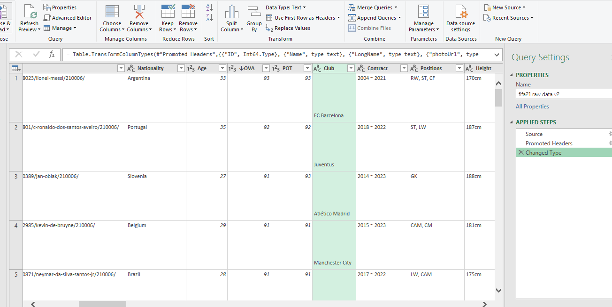
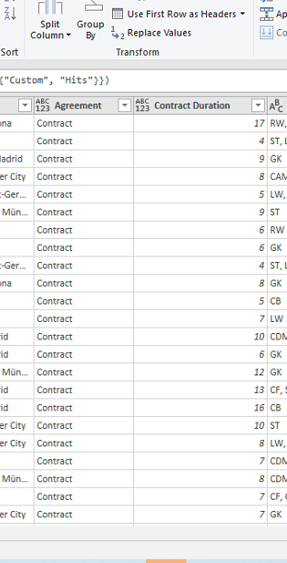
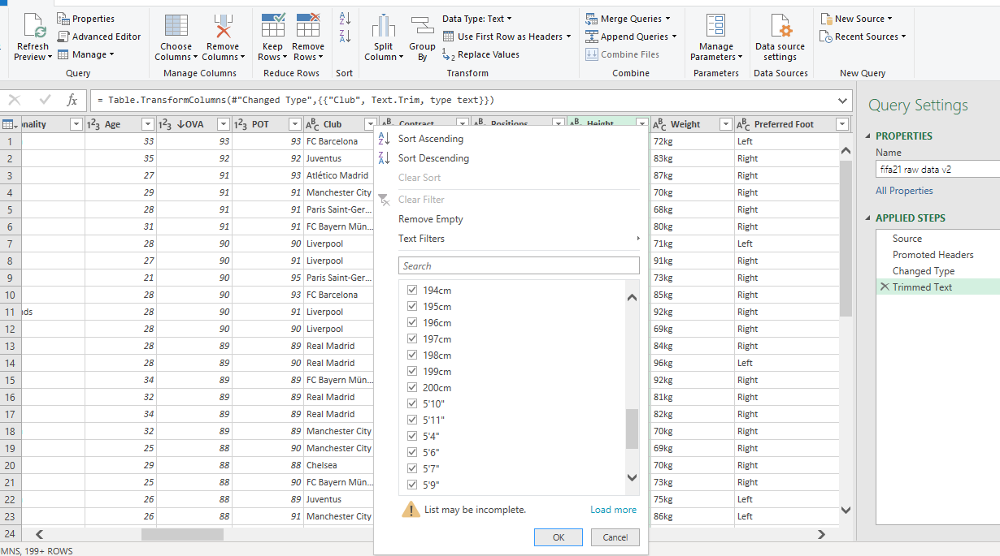
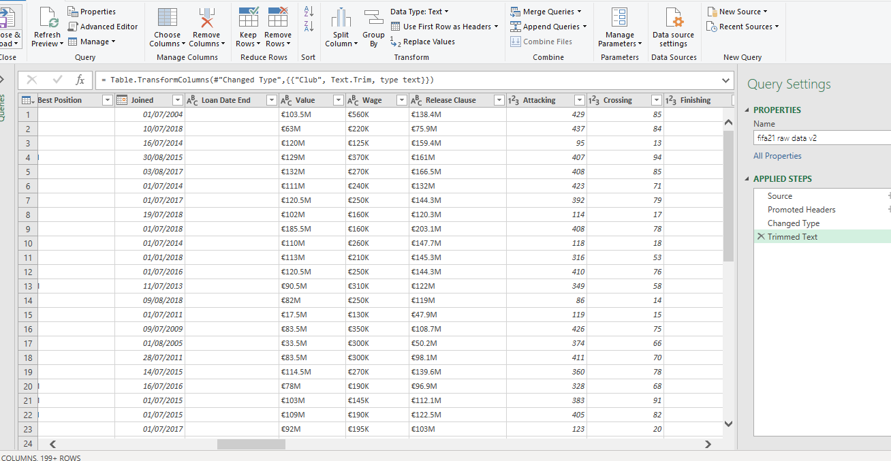
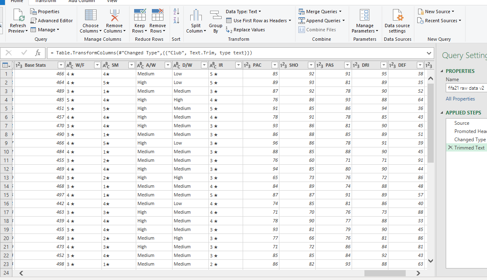

# Datacleaningchallenge
A FIFA 2021 data Cleaning Challenge


# Introduction

Data cleaning is a crucial step in any data analysis project, and it can be a complex and time-consuming task. The aim of this challenge is to enhance our expertise in cleaning and preparing datasets for analysis. We worked with real-world datasets, which contains incomplete, inconsistent, and messy data that requires careful cleaning and processing. During the challenge, I use MsExcel and Powerbi to clean the data, including managing missing values, handling outliers, standardizing formats, and managing duplicate records. By the end of the challenge, I gained valuable experience in data cleaning and was better equipped to handle complex data in our future data analysis projects. I'm looking forward to collaborating with other experts and opened to Internship opportunities.

# Data Source

The FIFA 21 data, which was obtained from Kaggle, is the dataset used for this challenge. The raw dataset was collected by web scraping from sofifa.com and consists of information on football players and their performance, updated as of 2021. The dataset is fairly large, containing 18979 rows and 77 columns. The columns cover various aspects of FIFA player statistics, including player name, club, nationality, position, earnings, performance metrics, and more. It's important to note that the data types in the dataset include whole numbers, text, and dates.

# Problem Statement

The data collected were inaccurate or incomplete, which is preventing us from drawing meaningful conclusions. We need to verify the accuracy of the data and fill in any missing information.

Some of the data in our dataset is in the wrong format or has the wrong data type, making it difficult to analyze. We need to identify this data and convert it to the correct format or data type.

The text-based data in our dataset contains formatting issues or unwanted characters that are affecting our analysis. We need to clean up this data to ensure its accuracy.

The dataset contains too many variables or too much irrelevant data that is not necessary for our analysis. We need to remove these variables or data points to focus only on the most relevant data.

The data in our dataset has not been properly labeled or categorized, making it difficult to analyze. We need to review and revise the labelling and categorization of the data to ensure its accuracy and relevance to our analysis.

# Data Transformation/Cleaning

Data was effieciently cleaned and transformed with the Power Query Editor of Power BI (a screenshot of the applied steps) Some of the applied steps includes

## - Removing Speacial Characters

The dataset while imported directly from Kaggle.com has some special characters which really affect the way the Long Name column and the players names was spelt. The data has some special characters which on the long run will affect visualization. Names of Players like Sane, Mbappe, Kante among others were affected.

Before


I had to change the file origin to 65001: Unicode (UTF-8) to erradicate the speical characters and moving forward our Long Name column looked superb.Here is a video of how I was able to achieve that: https://youtu.be/-B9FhJfDrIo

After


## - Invisible Blank/Strings

During the process of cleaning the data, a problem was discovered in the "Club" section. There were some unclean data in this section that required cleaning. The method used was to right click, then select Transform, then select TRIM, TRIM function in Power Query was utilized to clean the data in this column. The application of this function got rid of any superfluous white spaces, line breaks, or non-printable characters in the "Club" column. The outcome was a more uniform and tidy dataset. [Check the preview below;] 

Before
        

After


## - Contract Column Transformation

The 'Contract' column contained conflicting data type and values that were not uniform. Specifically, the column included three types of information presented in different formats: 'on loan' with the date of 23rd July 2020, 'Free', and a range of years from 2004 ~ 2021.

Before


Two modifications were implemented to enhance the precision and practicality of the data. Firstly, a fresh column designated as "Contract Status" was created to specify the kind of arrangement for each player. Secondly, a new column called "Contract Duration" was formed to evaluate the length of each player's contract in years. To achieve this, the transformation employed the Text.BeforeDelimiter and Text.AfterDelimiter functions to extract the beginning and ending years of the contract from each record in the "Contract" column, respectively.

After



This is the syntax used to effect changes and also the recording: https://youtu.be/cCj-g0pEXmY

```
if Text.Contains([Contract], "~")
then Number.From( Text.AfterDelimiter([Contract], "~"))- Number.From( Text.BeforeDelimiter([Contract], "~"))
else [Agreement]
```
The duration of the contract in years was then identified by measuring the disparity between them. In instances where the "Contract Status" column indicated that the player was not bound by a contract ("Free" or "Loan"), the localizing record in the "Contract" column was extracted.


## - Height Column Transformation

The 'Height' and 'Weight' columns displayed inconsistencies in their measurement units. The 'Height' column contained entries in '110cm' and 5'2" (feet and inches) format, while the data type was saved as text. To convert the data type to a whole number, the suffixes were eliminated from all values in both columns. In order to do so, the values in the 'Height' column in feet and inches were modified to 'cm', and the weight values in pounds were adjusted to 'kg' before removing the unneeded suffixes.



The interconversions was possible using the formula below for height column conversion and weight column conversion: https://youtu.be/AkRtJNukxUg

Height
```
For height: if Text.EndsWith([Height], "cm") then Number.FromText(Text.RemoveSuffix([Height], "cm")) else let feet = Text.BeforeDelimiter([Height], "’"), inches = Text.BeforeDelimiter(Text.AfterDelimiter([Height], "’"), """"), totalInches = (Number.FromText(feet) * 12) + Number.FromText(inches), cm = totalInches * 2.54 in cm
```

Weight
```
For weight: if Text.EndsWith([Weight], "lbs") then Number.FromText(Text.Start([Weight], Text.Length([Weight]) - 3)) * 0.45359237
else Number.FromText(Text.Start([Weight], Text.Length([Weight]) - 2))
```
After


## - OVA and POT Column Transformation:

While cleaning the data, it was observed that the "OVA" and "POT" columns contained text data types for values that were originally percentages. Therefore, the dataset underwent a transformation to change the data type to a percentage and format the values as percentages. https://youtu.be/-dZjIUXdY40

Before


After


## - Value, Wages and Release Clause Column

The 'Value', 'Weight', and 'Release_clause' columns presented issues with their data types and contained values with prefixes denoting millions, thousands, and euros. 

Before




To standardize the values by removing their prefixes and converting them to whole numbers and decimals, a new conditional column was added, similar to the 'Hits' column. The prefixes were replaced with spaces, the data types were transformed, and a custom column computed the product of the values in the original columns and the conditional ones. The resultant columns with standardized values were converted to whole numbers and renamed accordingly.

Note: The same method used to clean up the 'Value' column was also adopter for the other two columns.https://youtu.be/AsrOO6fhqdk


## - W/F, SM and IR Column

The data in the W/F and SM IR Columns were marked with a star "★" symbol, which I then removed and converted the data into whole numbers.Here is a video on how it was cleaned: Chttps://youtu.be/3vyk2iIZcEY

Before



After


## - Hits Column

I worked on the "Hits" category, where values were presented in thousands, denoted by the letter "K" (for instance, 1.6K instead of 1600). I transformed these values into whole numbers by eradicating the "K" and multiplying the numerical value by 1000. Once that was done, these amended values were entered into the column as the new reference points.
Here is a video of how this was achieved: https://youtu.be/9GPRL_5Px4M

Before


After


# Conclusion

The project shows that cleaning data is important to make sure it's accurate and reliable. I successfully cleaned the FIFA 21 data, and now it can be studied more.


Chat me up on Linkedln: http://linkedin.com/in/salau-gideon-ond-aat-bsc-and-aca-in-view-330a4a1a0

Twitter: @LateefGideon

Whatsapp: 08100657265


